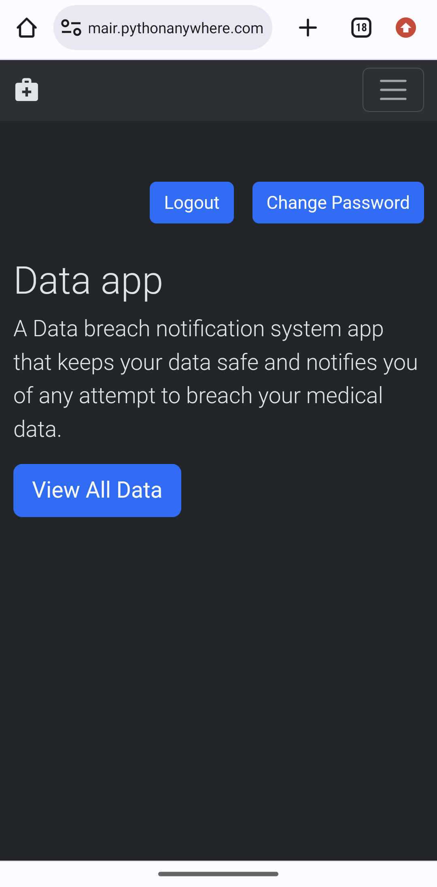
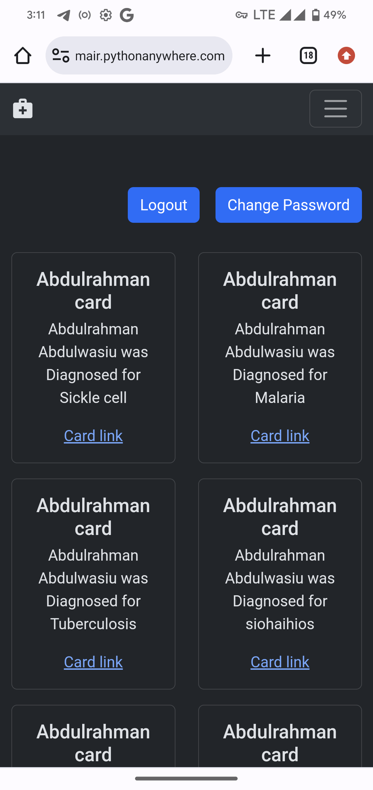
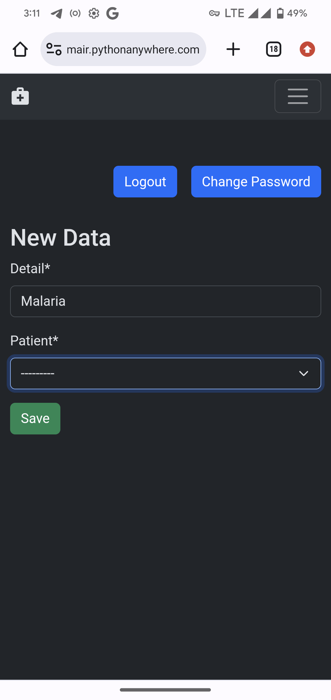

# Breach Notification Application
 
 An application for use in medical fields where the need for storing, and securing sensitive data is very crucial.

<h1>Project Description</h1>
                                                                  
<ul>
 <li>A medical application that stores client/patients details in card like elements for ease of access.</li>
 <li>Gives full authorization to medical admins(Doctors, medical officers) to seamlessly operate the whole of the application.</li>
<li>Medical admin(alone) are sent an email in case of an Illegal login attempt on the application.</li>
<li>Medical admins are privileged to reset their passwords from the mail.</li>
</ul>

<h1>App walkthrough</h1>

Application homepage

Patients details page stored in card-like elements

Creating new data for patient

Display page for an illegal login attempt.

<a href="https://abuumair.pythonanywhere.com">Click to view project live deployment</a>